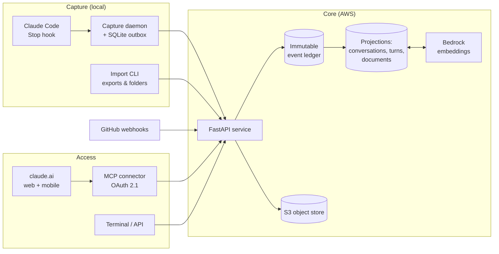

# Personal Intelligence System

A self-hosted, conversation-first knowledge ledger. It continuously captures
your AI-assisted work — **Claude Code sessions, claude.ai chats, uploaded
documents, GitHub activity** — into an immutable event ledger, and makes all
of it searchable (keyword + semantic) from anywhere: your terminal, claude.ai
on the web, or your phone.

The core idea: your most valuable knowledge isn't in your file system — it's
in your conversations. This system treats every AI conversation as a
first-class, permanent, queryable record.



## What it does

- **Captures automatically.** A Claude Code `Stop` hook records every coding
  turn (prompt, response, tools used, files changed, git context) seconds
  after it happens. On claude.ai, Claude itself writes to the ledger through
  MCP tools (`kb_capture_note`, `kb_capture_document`).
- **Ingests your history.** Importers for Claude Code transcripts, claude.ai
  account exports, and ChatGPT account exports — including text extracted
  from documents you uploaded into chats. Every import is idempotent:
  re-running adds only what's new.
- **Remembers documents.** PDFs, DOCX, and text files are stored
  content-addressed in S3, chunked, embedded, and linked to the conversations
  that referenced them.
- **Finds things by meaning.** Hybrid retrieval: PostgreSQL full-text search
  and pgvector cosine similarity, fused with reciprocal rank fusion. A
  paraphrase finds the conversation even when no keywords match.
- **Answers from anywhere.** An OAuth-protected MCP server exposes the ledger
  to claude.ai (web, desktop, mobile) as a custom connector, so you can ask
  "what did I decide about X last month?" from your phone.
- **Links code to conversations.** GitHub push webhooks connect commits back
  to the Claude Code session that produced them.

## Architecture in one paragraph

Every capture becomes an immutable **event** (unique content hash, database
trigger blocks UPDATE/DELETE). Normalizers project events into queryable
tables — conversations, messages, turns, documents — that can be dropped and
rebuilt from the ledger at any time. Policy (deny-lists, secret scanning)
runs server-side on every write; secrets are additionally redacted
client-side before upload. Retrieval layers exact match, full-text, and
vector search over the projections. The MCP layer is a thin adapter: every
tool wraps a retrieval or ingestion function 1:1.

Read the full walkthrough in [docs/ARCHITECTURE.md](docs/ARCHITECTURE.md).

## Stack

Python 3.12 · FastAPI · PostgreSQL 16 + pgvector · SQLAlchemy 2 + Alembic ·
MCP Python SDK · AWS (App Runner, RDS, S3, Secrets Manager, Bedrock via CDK) ·
pytest (95 tests)

Runs for roughly **$40/month** on AWS, or entirely locally with Docker.

## Quick start (local)

```bash
docker compose up -d postgres     # pgvector-enabled Postgres
uv sync
uv run alembic upgrade head
uv run pytest -q                  # 95 tests
uv run python -m pis.api          # API on 127.0.0.1:8800
```

## Deploy to AWS

```bash
cd infra && npm install
CDK_DEFAULT_ACCOUNT=<your-account> npx cdk deploy   # RDS, S3, secrets, roles, Bedrock endpoint
./scripts/create-service.sh                          # App Runner service
```

The container migrates the database at boot and serves the API + MCP
endpoint. Subsequent code changes: `npx cdk deploy && ./scripts/update-service.sh`.

## Connect claude.ai

1. Settings → Connectors → **Add custom connector** → `https://<service-url>/mcp`
2. Approve with your passcode (generated in Secrets Manager at deploy).
3. Chat naturally: *"search my ledger for …"*, *"log this decision"*,
   *"save this document"*.

The server implements OAuth 2.1 with dynamic client registration and PKCE,
so no client IDs or secrets are ever pasted around.

## Capture your history

```bash
# Claude Code transcripts (local JSONL)
uv run pis import run ~/.claude/projects --api-url $URL --token $TOKEN

# claude.ai account export (Settings → Privacy → Export data)
uv run pis import run export.zip --adapter claude-export --api-url $URL --token $TOKEN

# ChatGPT account export
uv run pis import run export.zip --adapter chatgpt-export --api-url $URL --token $TOKEN

# Documents from folders
uv run pis artifacts scan ~/Documents --api-url $URL --token $TOKEN
```

Live capture: `integrations/claude-code/install-daemon.sh` installs a
launchd daemon and the Stop hook wiring; every future Claude Code turn lands
in the ledger automatically.

## Security model

- Ledger immutability enforced by the database, not convention.
- All personal data lives in your Postgres/S3 — never in this repo.
- Secret scanning both client-side (redact) and server-side (reject + audit).
- Deny-lists for repositories/paths that must never be captured.
- MCP and API are bearer/OAuth-gated; the consent screen is passcode-locked.
- Capture is fail-open for your tools (a dead daemon can never block Claude
  Code) and fail-closed for data (unauthenticated writes are impossible).

## Status & roadmap

Working today: capture (Claude Code + claude.ai), historical import, hybrid
semantic search, document ingestion, MCP connector, session↔commit linking.

Next: LLM-based memory extraction (distilling history into decisions, claims
and per-project context packs), curation workflow, artifact binary
resolution, isolated finance vault.
