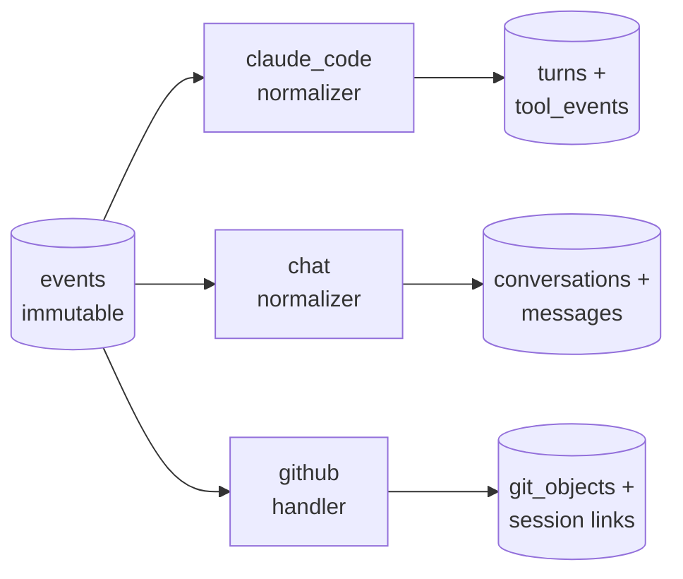
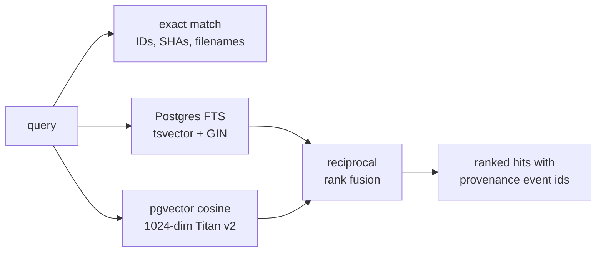
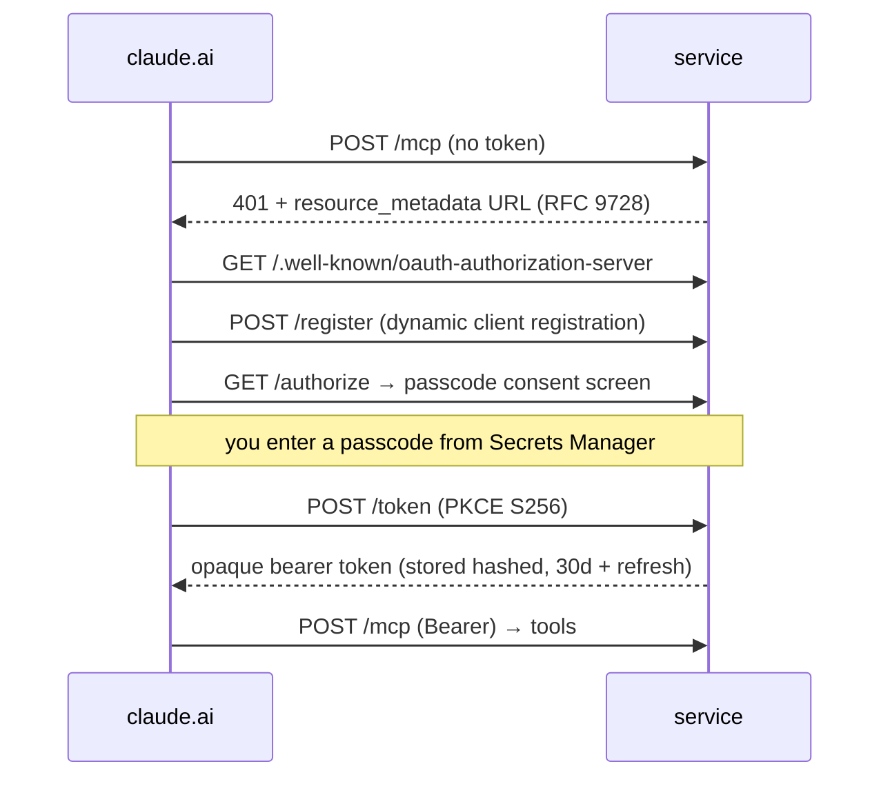
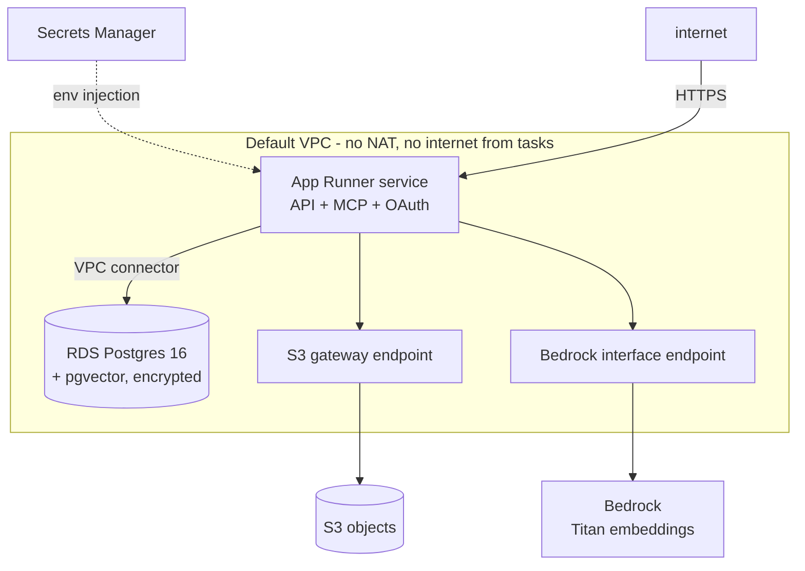

# Architecture

This document walks through how the system works, layer by layer, and why
each piece is shaped the way it is.

## 1. The core invariant: events are immutable

Everything that enters the system becomes a **canonical event** — a Pydantic
model with a deterministic SHA-256 content hash over its meaningful fields
(provider, conversation, role, content, timestamps, metadata):

```
event_id        evt_<uuid>          # identity of this capture
content_hash    sha256:<hex>        # identity of this CONTENT (unique index)
event_type      claude_code.turn.completed | conversation.message.completed | github.push | ...
provider        claude_code | claude | chatgpt | github
content_parts   [{type: text|attachment, text, metadata}]
```

Two guarantees follow:

- **Idempotency.** Replaying any input — a retried upload, a re-imported
  export, a duplicate webhook — hits the `content_hash` unique index and
  becomes a no-op. Importers can be re-run forever; only new content lands.
- **Immutability.** A PostgreSQL trigger raises on any `UPDATE` or `DELETE`
  against the events table. Corrections are *new* events; history is never
  rewritten.

Everything else in the database is a **projection**: normalizers read events
and maintain query-friendly tables (`conversations`, `messages`,
`message_revisions`, `turns`, `tool_events`, `artifacts`, …). Projections can
be truncated and rebuilt from the ledger — they are cache, not truth.



## 2. Capture paths

| Source | Mechanism | Latency |
|---|---|---|
| Claude Code (live) | `Stop` hook → local daemon → API | seconds |
| Claude Code (history) | JSONL transcript importer | one command |
| claude.ai (live) | Claude calls `kb_capture_note` / `kb_capture_document` via MCP | in-chat |
| claude.ai (history) | Account-export importer (incl. attachment text) | one command |
| ChatGPT (history) | Account-export importer (node-graph traversal) | one command |
| Documents | Folder scanner / upload endpoint | one command |
| GitHub | Signed push webhooks | seconds |

**The hook can never break your tools.** The Claude Code hook is a
stdlib-only script with a 2-second network timeout that always exits 0. If
the daemon is down, the turn is simply missed live — and recovered later by
the idempotent transcript importer. Capture is best-effort; ingestion is
exactly-once.

**The daemon is a buffer, not a brain.** It authenticates producers, redacts
secrets locally, appends to a SQLite outbox, and flushes to the cloud API
with retry. Offline work syncs when connectivity returns.

## 3. Policy: enforced in code, not prompts

Every write passes through the same gate server-side:

1. **Deny-lists** — glob patterns for repositories and paths that must never
   be captured (e.g. employer code). Checked against event metadata.
2. **Secret scanning** — regex detectors for API keys, tokens, private keys,
   connection strings, SSNs. The daemon *redacts* client-side
   (`[REDACTED:kind]`), and the server *rejects* anything that still matches
   — defense in depth. Every rejection is written to an audit log.

## 4. Retrieval: three engines, one ranking



- **Exact** for identifiers: commit SHAs, filenames, message ids.
- **Full-text** via generated `tsvector` columns with GIN indexes — zero
  extra infrastructure, surprisingly strong for keyword recall.
- **Semantic** via pgvector HNSW indexes over Bedrock Titan embeddings.
  Embedding happens at ingest time (best-effort — a Bedrock outage never
  blocks capture) with a backfill endpoint for history.
- **Hybrid** fuses FTS and semantic lists with reciprocal rank fusion
  (k=60) — cheap, rank-based, no score calibration needed. It degrades
  gracefully: if embeddings are disabled or unavailable, results are
  FTS-only.

Every hit carries the `event_id` that produced its content — answers are
always traceable to their source capture.

## 5. Documents

Files are stored **content-addressed** (`objects/sha256/ab/cd/<hash>`) in
S3 — the same bytes uploaded from three conversations are stored once and
referenced three times. The pipeline:

```
bytes → sha256 dedupe → S3 → text extraction (pypdf / python-docx / plain)
      → ~1500-char chunks with structural locators (page, part)
      → tsvector + embedding per chunk → searchable as kind "document"
```

`artifact_references` links artifacts to the conversations that mentioned
them, with an explicit resolution status — a reference whose binary was
never recovered stays visible as `unresolved_missing_binary` rather than
silently disappearing. A folder scan that later finds the file (by content
hash) resolves it.

## 6. The MCP layer

The MCP server is deliberately thin: each tool wraps one retrieval or
ingestion function. If the tool layer ever needs logic, that logic belongs
below it.

| Tool | Wraps |
|---|---|
| `kb_search` | hybrid/FTS/exact retrieval |
| `kb_get_conversation` | conversation + messages + tools + documents |
| `kb_get_session_for_commit` | session↔commit links |
| `kb_recent_activity` | latest conversations |
| `kb_capture_note` | event ingestion (write) |
| `kb_capture_document` | artifact ingestion (write) |

### OAuth for a single human

claude.ai custom connectors require a remote MCP server with OAuth. Rather
than run a third-party identity provider for one user, the service embeds a
minimal OAuth 2.1 authorization server:



Implementation notes that cost real debugging time: MCP clients drop
`Authorization` headers on redirects, so the endpoint must serve exactly
`/mcp` with no trailing-slash 307; and a mounted sub-application's lifespan
doesn't run automatically — the MCP session manager must be driven from the
outer app's lifespan.

## 7. AWS topology



Design choices worth copying:

- **No API keys anywhere.** Embeddings (and future LLM extraction) go
  through Bedrock with IAM role auth. Tokens and passcodes are generated by
  CloudFormation into Secrets Manager and injected as env vars.
- **Tasks have no internet.** All egress is via VPC endpoints. This bit us
  once (a container that phoned PyPI at boot crash-looped) and the fix — run
  the venv interpreter directly, never a resolver — made images
  deterministic anyway.
- **The service is decoupled from the substrate.** CloudFormation owns the
  durable pieces (database, bucket, secrets, roles); the App Runner service
  is created by script. A bad service deploy can be retried in minutes
  without CloudFormation rolling back the database.
- **Migrations at boot.** The container runs `alembic upgrade head` before
  serving — one deploy artifact, no migration orchestration.

## 8. Testing philosophy

95 tests, all against a real Postgres (pgvector image) — no mocked SQL.
Fixtures are entirely synthetic. The suite includes an end-to-end acceptance
test that walks the full slice: hook-parsed transcript → daemon → API →
ledger → projections → search returning the source event id → replay of
every input proving zero duplicates. Embeddings are tested with a
deterministic fake embedder; document extraction with generated files.

## 9. What's deliberately not here (yet)

- **Memory extraction** — LLM distillation of history into decisions,
  claims, and per-project context packs (the next phase; Bedrock wiring is
  already in place).
- **Curation** — a review workflow promoting machine-extracted memories to
  user-confirmed truth.
- **Finance** — designed as a separately-scoped vault, isolated from
  general search by construction.
